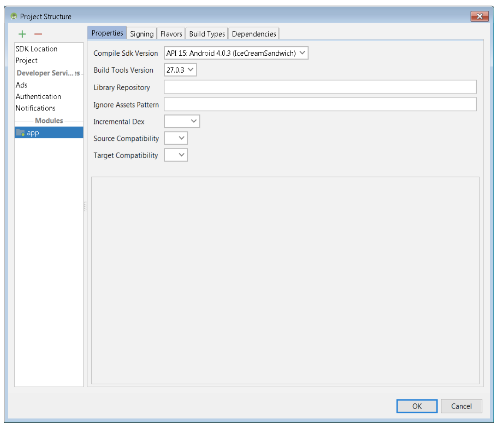
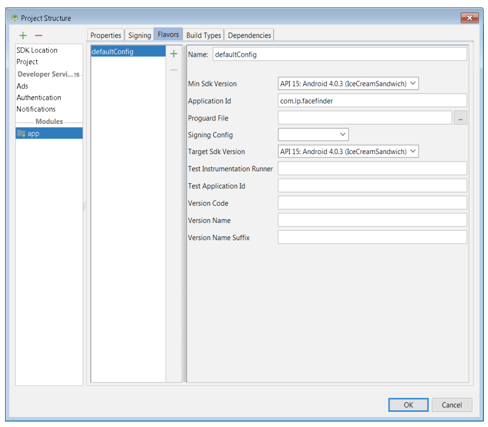
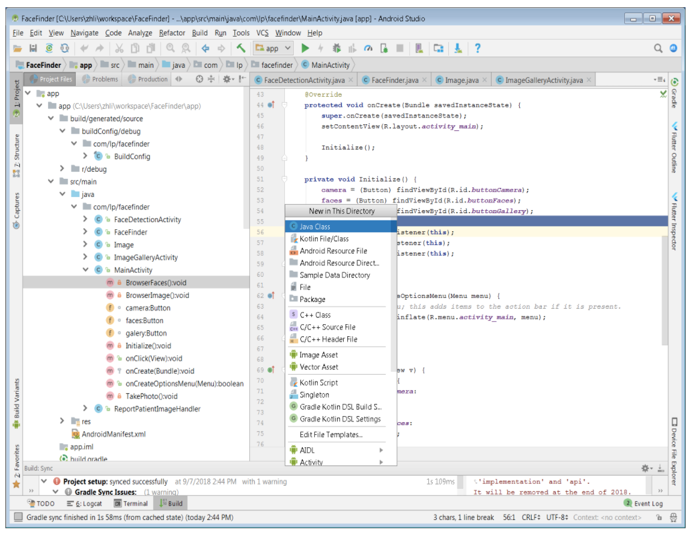

# FaceFinder - Android #

The FaceFinder app is designed to test the AI algorithm in FaceMatch project. It detects the faces in the photos and send the data back to the FaceMatch for research. It works in two modes: manual and batch. In manual mode, it process a single selected photo. In batch mode, it detects all the image photos in a specified directory and save the results to a date file. The FaceFinder app is the property of CEB, the Lister Hill National Center for Biomedical Communications, which is an intramural R&D division of the U.S. National Library of Medicine, part of the U.S. National Institutes of Health.  

### Installation ###

- Android Studio  
- Developed with Android Studio 3.1.4  
- Android 4.3+  
- Built With: Java language, Android API  

### The Top-Level Build File ###

```
apply plugin: 'com.android.application'

android {
    compileSdkVersion 15
    buildToolsVersion '27.0.3'

    defaultConfig {
        applicationId "com.lp.facefinder"
        minSdkVersion 15
        targetSdkVersion 15
    }

    buildTypes {
        release {
            minifyEnabled false
            proguardFiles getDefaultProguardFile('proguard-android.txt'), 'proguard-rules.txt'
        }
    }
}
dependencies {
    compile 'com.android.support:support-v4:18.0.0'
}
```

### Project settings ###

  

  

  